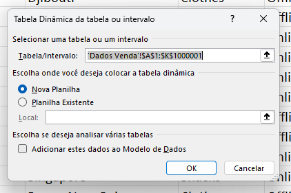

### Capítulo 2: Nivelamento de Cálculos In-Memory

#### Introdução

Antes de iniciarmos efetivamente nosso conteúdo sobre matrizes e fórmulas matriciais, é essencial entendermos que alguns vícios adquiridos ao trabalhar com Excel podem prejudicar significativamente a performance das nossas soluções no Power BI. Esses hábitos, muitas vezes, acabam também impactando negativamente a performance das soluções desenvolvidas no próprio Excel. Nosso objetivo aqui é fazer com que você compreenda o motivo por trás de cada ação, diferenciando-se assim como um profissional capaz de explicar suas escolhas e melhorar a performance das suas soluções.
Para acompanhar os exemplos deste capítulo, você deverá baixar o arquivo `Dataset_Excel.xlsx`, do repositório deste livro, localizado em https://github.com/tatianaesc/powerbi. Este arquivo consiste em uma planilha Excel com 1.000.000 de registros e 67 MB de tamanho.

#### Colunas Calculadas: Um Grande Vilão

Um dos maiores vilões no Power BI e também no Excel é o uso excessivo de colunas calculadas. Uma coluna calculada é aquela coluna auxiliar onde inserimos fórmulas para obter novos dados, como `PROCV`, `SE`, `CONT.SE`, entre outras. Para ilustrar, vamos considerar um exemplo prático usando nossa planilha.

Suponha queremos criar uma coluna calculada para multiplicar a quantidade pelo preço unitário e, em seguida, somar os resultados dessa nova coluna.

1. **Criando a Coluna Calculada:**
   - Vá para a primeira coluna vazia da planilha (coluna L) e nomeie-a como `VLR Venda`.
 

   - Na célula L2, insira a fórmula de multiplicação `=Qtde * Preço Unitário`.
 

   - Preencha a fórmula para todas as linhas dando um duplo clique no canto inferior direito da célula L2.
 

Suponha que agora queremos criar uma coluna para calcular o total do valor de venda. Para tal, iremos utilizar a célula N2.

2. **Agregando os Dados:**
   - Utilize a função `SOMA` para totalizar os valores da coluna calculada.
 

- Altere o formato da célula N2 para “Contábil”, usando a combo de formatos na barra superior do menu “Página Inicial”.
 

- Repare que o valor total foi o mesmo obtido no exemplo anterior:   
 

- Salve o arquivo com um novo nome para comparar o tamanho.

Ao salvar, notamos que o tamanho do arquivo aumentou de 67 MB para 84 MB. Isso se deve ao fato de que, ao criar a coluna calculada, o Excel precisa armazenar essas novas informações, aumentando significativamente o tamanho do arquivo.
 

#### Utilizando Tabelas Dinâmicas

Uma alternativa ao uso de colunas calculadas é a utilização de Tabelas Dinâmicas. Vamos recriar o mesmo cálculo utilizando este recurso. Para tal, abra novamente o arquivo original `Dataset_Excel.xlsx`.

ATL TB
Inserir tabela dinâmica
1. **Criando a Tabela Dinâmica:**
   - Insira uma Tabela Dinâmica a partir dos dados originais. Para tal, clique na opção “Tabela Dinâmica”, no menu “Inserir”, e em seguida escolha a opção “Da Tabela/Intervalo”.
 

- Mantenha selecionada a opção “Nova Planilha” e clique em “OK”.
 

 

   - Crie um campo calculado “Resultado” dentro da Tabela Dinâmica com a fórmula `=Qtde * Preço Unitário`. Para tal, selecione a opção “Campo calculado” dentro do submenu “Campos, Itens e Conjuntos”, dentro do menu “Análise de Tabela Dinâmica”. Clique no campo “Qtde”, digite “*” e em seguida, clique no campo “Preço Unitário”. Finalmente, clique em “OK”.
 

 

- Altere o formato da célula A4 (resultado que acabamos de calcular), para “Contábil”, usando a combo de formatos na barra superior do menu “Página Inicial”
 

 

2. **Comparando o Tamanho do Arquivo:**
   - Salve o arquivo com um novo nome.
   - Observe que o tamanho do arquivo resultante é de 101 MB, quase dobrando o tamanho original.
 

Isso ocorre porque, além de armazenar a nova informação, a Tabela Dinâmica carrega na memória diversas funcionalidades que, mesmo não sendo utilizadas, aumentam o tamanho do arquivo.

#### Cálculos Matriciais: A Solução Eficiente

A maneira mais eficiente de realizar cálculos complexos sem comprometer a performance é através dos cálculos matriciais. Vamos replicar o mesmo cálculo usando uma fórmula matricial. Para tal, abra novamente o arquivo original `Dataset_Excel.xlsx`.

1. **Criando o Cálculo Matricial:**
   - Na célula M2, insira a fórmula matricial `=SOMA(I2:I1000001*J2:J100001)`.
 

   - Ao pressionar `Enter`, o Excel calcula o resultado para todas as linhas de maneira otimizada. Novamente, altere o formato desta célula para “Contábil” e perceba que o resultado é o mesmo dos exemplos anteriores.
 

2. **Comparando o Tamanho do Arquivo:**
   - Salve o arquivo com um novo nome.
   - Note que o tamanho do arquivo permanece praticamente inalterado (apenas 1KB de diferença), em torno de 67 MB.
 

#### Conclusão

O uso de cálculos matriciais não só mantém a performance do seu arquivo como também é a base para entender os cálculos DAX (Data Analysis Expressions) utilizados no Power BI. Este capítulo demonstrou que vícios como colunas calculadas e uso excessivo de Tabelas Dinâmicas podem ser substituídos por métodos mais eficientes, permitindo um melhor desempenho das suas soluções. No próximo capítulo, abordaremos detalhadamente como e por que utilizar funções matriciais, e como isso se traduz em melhores práticas para o uso de DAX no Power BI. 

Vamos juntos explorar essas técnicas e aprimorar ainda mais suas habilidades em Data Analytics e Modelagem com Power BI.
