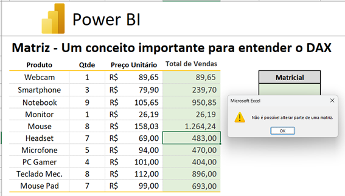
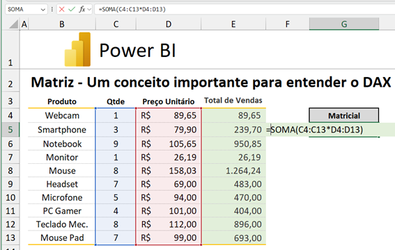
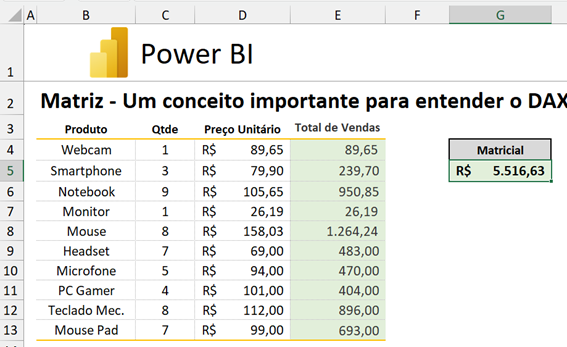
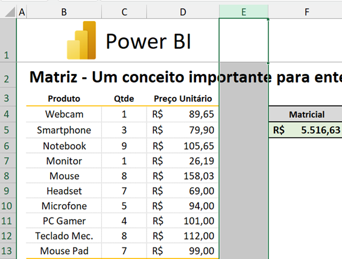
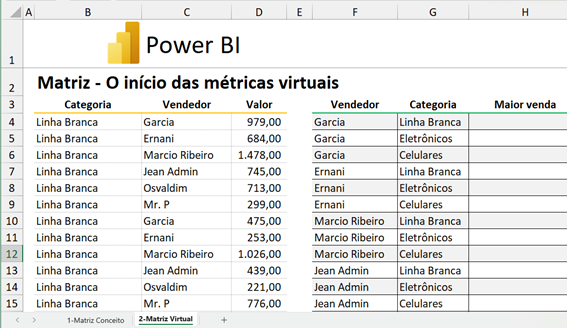
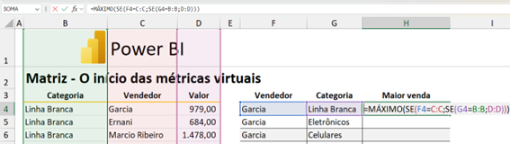
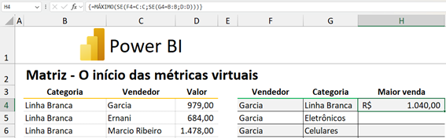

## Capítulo 3: Array Formulas vs Cache

Para acompanhar este capítulo, localize dentro do repositório do livro a arquivo "Exercício01". Se aparecer uma faixa amarela para habilitar o conteúdo, habilite-a para poder editar o arquivo e começar o nosso exercício.
No capítulo anterior, mostramos como alcançar resultados de performance superior e redução no tamanho do arquivo usando fórmulas matriciais. Agora, vamos entender o porquê disso.
### Trabalhando com os Motores de Cálculo do Excel
Se pedirmos para fazer a multiplicação da quantidade pelo preço unitário, provavelmente você fará a operação célula a célula, usando a fórmula `=C4*D4`, por exemplo. Após isso, você provavelmente replicará a fórmula para as demais células da coluna usando a alça de preenchimento (clicando no canto inferior da célula e dando um duplo clique). Esse processo é chamado de materialização do resultado (e estragará nossa formatação!):
 

 

Para que a nossa formação não seja alterada, podemos clicar no ícone no canto inferior direito da última célula e selecionar a opção “Preencher sem formatação”:
 

 

Se quisermos saber qual foi o resultado total geral, podemos ir na coluna E15 e digitar a fórmula `=SOMA(E4:E13)`e pressionar Enter.
A abordagem que utilizamos na coluna E, embora funcional, pode comprometer significativamente a performance do Excel a aumenta o tamanho do arquivo, como vimos no capítulo anterior. A coluna E é conhecida como “coluna auxiliar materializada”. Para compreender melhor, vamos explorar os diferentes motores de cálculo do Excel:

1. **Motor de Cálculo Enter:**
   - Quando você pressiona Enter, o Excel realiza cálculos relacionais, varrendo os dados da esquerda para a direita e de cima para baixo, como fizemos no exemplo anterior. Esse processo é comparável ao motor de um fusca: funcional, mas não muito potente.

2. **Motor de Cálculo Control + Shift + Enter:**
   - Ao usar fórmulas matriciais, você utiliza o segundo motor de cálculo do Excel, que é mais eficiente. Ao invés de calcular célula por célula e armazenar cada resultado no arquivo, o cálculo é feito na memória (cache) e apenas o resultado final é retornado para o Excel. Isso reduz significativamente o tamanho do arquivo e melhora a performance.

Vamos agora apagar o conteúdo da nossa coluna materializada de resultados (coluna E) e fazer este cálculo usando este segundo motor de cálculo. Para tal, selecione o intervalo E4:E13 e pressione a tecla F2. Em seguida, na célula em que o cursor aparece piscando (E4), digite a fórmula `=C4:C13*D4:D13`.
 

Em vez de pressionar Enter, pressione `Control + Shift + Enter` para finalizar a fórmula e replicá-la em todas as células da coluna. Isso executará o cálculo na memória, retornando o resultado sem armazenar dados intermediários no arquivo. 
O fizemos foi fazer a multiplicação da matriz unidimensional “Qtde” pela matriz unidimensional “Preço Unitário”. Repare que o resultado final foi o mesmo, mas que na barra de fórmulas, a fórmula que digitamos foi inserida entre chaves, indicando que este cálculo é uma fórmula matricial.
 

Usando este recurso, se tentarmos alterar uma ou mais células de fora isolado do total de vendas, não será possível:
 

Como a fórmula matricial ocupa toda a matriz, só conseguiremos deletar a matriz se selecionarmos toda ela.
Já melhoramos nossa forma de fazer o cálculo, mas ainda estamos materializando uma coluna, usando a coluna auxiliar E. Vamos então criar uma fórmula matricial para calcular a soma da multiplicação entre a quantidade e o preço unitário, sem materializar o resultado em colunas auxiliares. Para tal:
   - Selecione a célula onde deseja ver o resultado final (no caso, a célula G5).
   - Pressione `F2` para editar a célula e insira a fórmula `=SOMA(C4:C13*D4:D13)`.
 

   - Em vez de pressionar Enter, pressione `Control + Shift + Enter` para finalizar a fórmula. Isso executará o cálculo na memória, retornando o resultado sem armazenar dados intermediários no arquivo.
 

Repare que o que fizemos foi simplesmente somar o resultado dos produtos das matrizes. Neste caso, o cálculo é realizado na memória: apenas o resultado final é armazenado no arquivo, economizando espaço. Lembre-se que a fórmula matricial é identificada pelas chaves `{}` no início e no fim da fórmula na barra de fórmulas.
Exclua a coluna E do arquivo e repare que o resultado matricial continua lá corretamente:
 

### Trabalhando com Fórmulas Matriciais Avançadas

Vamos agora aplicar o conceito de fórmulas matriciais em um cenário mais complexo, onde precisamos consolidar dados de vendas por categoria e vendedor, identificando apenas a maior venda. Para tal, abra a segunda aba (2-Matriz Virtual), no mesmo arquivo Excel.
 

Imagine que, na coluna H, queiramos consolidar a maior venda por vendedor e categoria. Poderíamos encontrar este valor utilizando manualmente os filtros na tabela da esquerda, mas vamos aprender uma criar a matriz resultado de forma automática no próximo exemplo.
- Na célula H4, insira a fórmula `=MÁXIMO(SE(F4=C:C;SE(G4=B:B;D:D)))`. 
Esta fórmula usa duas vezes a função `SE`para encontrar o valor, sendo a primeira para filtrar os dados por categoria e a segunda para filtrar os dados por vendedor. A função `MÁXIMO` é usada para encontrar a maior venda. 
 

   - Finalize a fórmula com `Control + Shift + Enter`.
 

   - Use a alça de preenchimento para replicar a fórmula para as demais células da coluna. O cálculo será feito na memória, mantendo o arquivo leve e performático.
 

### Conclusão
As fórmulas matriciais oferecem uma maneira eficiente de realizar cálculos complexos, utilizando o cache da memória ao invés de materializar dados no arquivo do Excel. Isso resulta em arquivos menores e com melhor performance, sendo uma técnica essencial para quem deseja se especializar em Data Analytics e Modelagem com Power BI.
No próximo capítulo, aprofundaremos o uso de DAX no Power BI, explorando como essas técnicas se traduzem em práticas de análise de dados avançadas. Vamos juntos aprimorar ainda mais suas habilidades!
